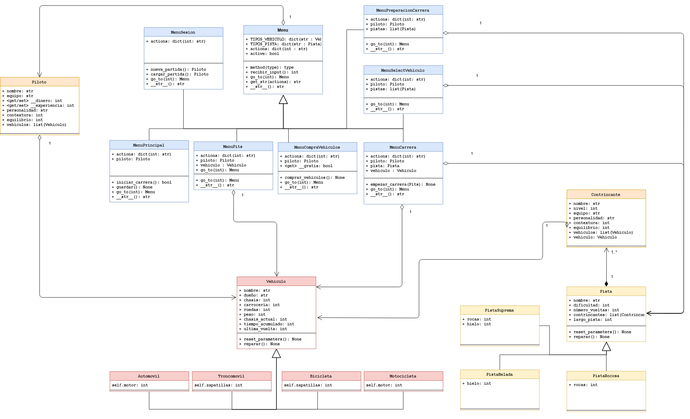

# Diagrama de Clases

## Consideraciones:
Por simplicidad, se tomaron las siguientes libertades
 - Las flecha de agregación que viene de Piloto a Vehículo debería estar unida a sus subclases.
 - Esto también aplica para **(2)** la flecha de agregación de Menú a Piloto, **(3)** las flechas de agregación las 3 subclases de Menu (MenuPreparacionCarrera, MenuSelectVehiculo y MenuCarrera) a Pista, **(4)** las flechas de agregación las 2 subclases de Menu (MenuPitsy MenuCarrera) a Vehículo, y **(5)** la flecha de agregación de Contrincantes a Vehículo (esta tiene un error visual). 

 